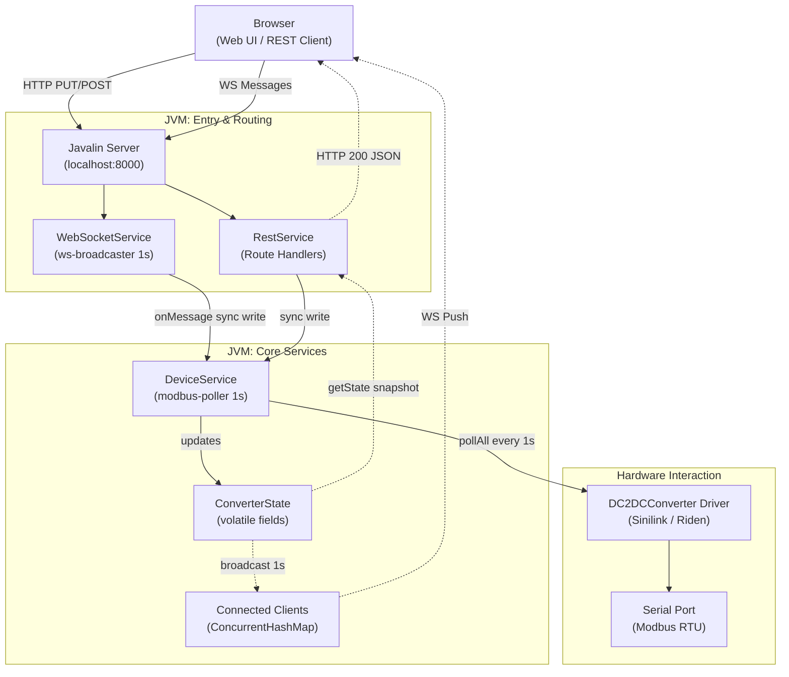
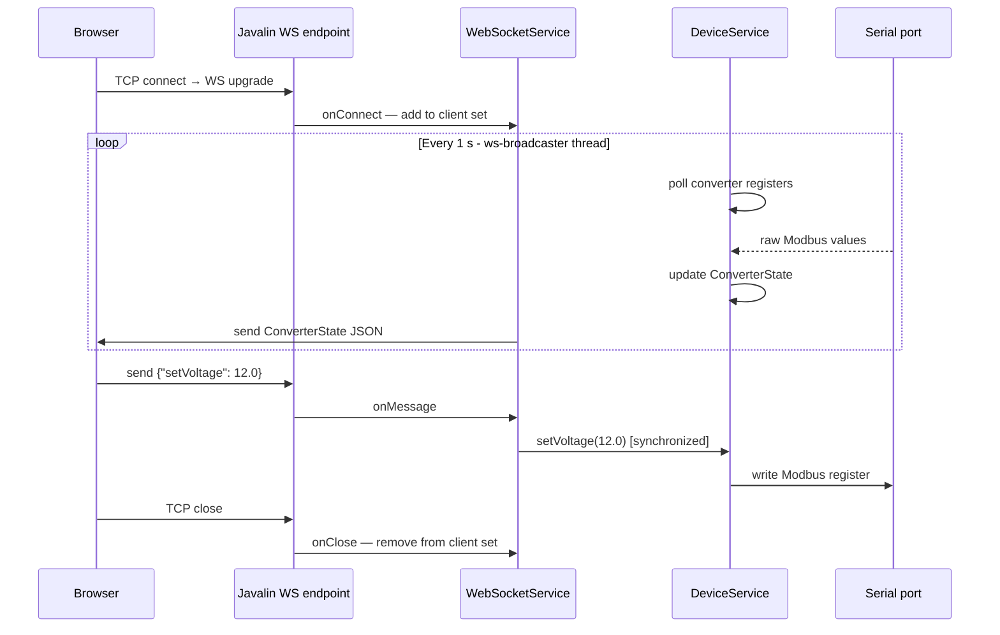
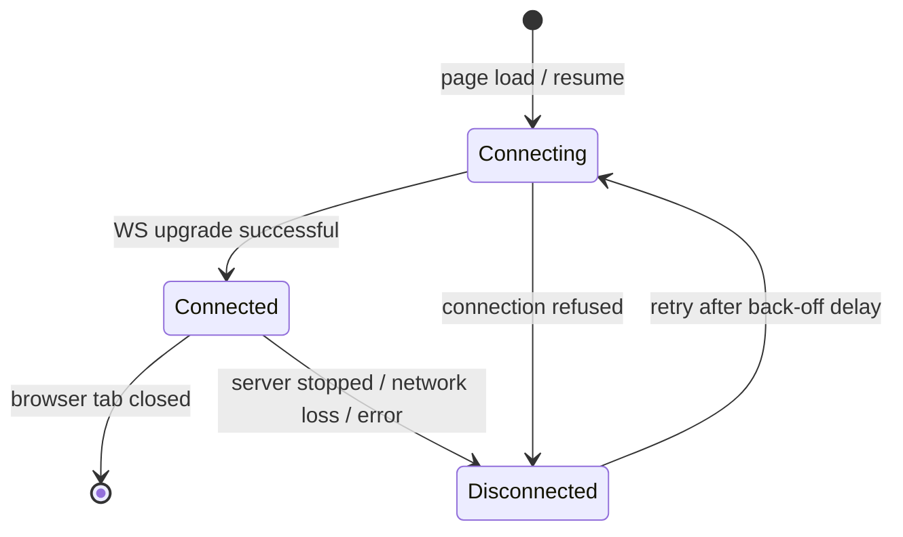

# Serial Controller

A Java 21 application that provides a web-based control panel for **Riden/Ruideng** and
**Sinilink** DC/DC converters connected over a serial (Modbus RTU) interface. It exposes a
REST + WebSocket API served by an embedded Javalin server and a fully-functional browser UI
with live telemetry and setpoint control.

---

## Supported Devices

| Manufacturer | Model family | Topology |
|---|---|---|
| Sinilink | XY6008 (and variants) | Buck |
| Riden / Ruideng | RD50xx series | Buck |
| Riden / Ruideng | RD60xx series | Buck/Boost |

Device detection is automatic - the application probes the serial port at startup and selects
the correct driver. See [Device Detection](#device-detection) for the probing order.

---

## Prerequisites

- **JDK 21** or later
- **Apache Maven 3.9+**

---

## Build

```bash
mvn clean source:jar install
```

This compiles the project, attaches a sources JAR, and produces a self-contained fat JAR at
`target/SerialController.jar` containing all runtime dependencies.

---

## Run

```bash
java -jar target/SerialController.jar <port> [config-file]
```

| Argument | Required | Description |
|---|---|---|
| `<port>` | Yes | Serial port name, e.g. `COM3` (Windows) or `/dev/ttyUSB0` (Linux) |
| `[config-file]` | No | Fully-qualified path to a `.properties` override file (see [Configuration](#configuration)) |

### Discovering available ports

Invoking the JAR **without arguments** prints all serial ports found on the system and then
shows the usage message - useful when you are unsure of the port name:

```
Serial Controller - Control Riden/Ruideng and Sinilink DC/DC converters v1.0.0

                  (C) by Roman Stangl 09, 2026 (Roman.Stangl@gmx.net)
                  http://warpguru.bplaced.net/

Usage:
  java -jar SerialController.jar <port> [config-file]
Where:
  <port>        Serial port name, e.g. COM3 or /dev/ttyUSB0
  [config-file] Optional: fully-qualified path to a properties file.
                Overrides credentials.properties defaults and may specify:
                  serialcontroller.host           Hostname/IP the server binds to
                  serialcontroller.port           TCP port the server listens on
                  serialcontroller.log.level      Log level (TRACE/DEBUG/INFO/WARN/ERROR)
                  serialcontroller.admin.username Username for GUI administration
                  serialcontroller.admin.password Password for GUI administration

Found 1 serial port(s):
  Port: COM3 | Description: Silicon Labs CP210x USB to UART Bridge (COM3) | Location: 0-1.1 | Manufacturer: Silicon Labs | Serial: 0001 | VID:PID: 0x10C4:0xEA60
```

If no serial devices are connected:

```
No serial ports found on this system.
```

### Normal startup

```bash
java -jar target/SerialController.jar COM3
```

The application starts an HTTP + WebSocket server on `localhost:8000` (configurable), detects
the converter, reads initial setpoints, and begins polling every second.

The server can be stopped via [`POST /api/exit`](#rest-api) (requires Basic Auth credentials) or `Ctrl+C`.

---

## Configuration

Configuration is loaded in two layers:

1. **Classpath defaults** - `credentials.properties` bundled inside the JAR (sets default admin credentials).
2. **External override file** (optional) - path supplied as the second command-line argument; any key present overwrites the bundled default.

| Property key | Default | Description |
|---|---|---|
| `serialcontroller.host` | `localhost` | Hostname or IP address the HTTP/WS server binds to |
| `serialcontroller.port` | `8000` | TCP port the server listens on |
| `serialcontroller.log.level` | _(from log4j2.xml)_ | Runtime log level for `com.serial.*` - `TRACE`, `DEBUG`, `INFO`, `WARN`, `ERROR`, `FATAL`, or `OFF` |
| `serialcontroller.admin.username` | _(bundled)_ | Username required for `POST /api/exit` |
| `serialcontroller.admin.password` | _(bundled)_ | Password required for `POST /api/exit` |
| `serialcontroller.max.setvoltage` | _(device limit)_ | Operator cap on output voltage setpoint (V); prevents accidental over-voltage on sensitive loads |
| `serialcontroller.max.setcurrent` | _(device limit)_ | Operator cap on output current setpoint (A) |

Example override file:

```properties
serialcontroller.port=9000
serialcontroller.log.level=DEBUG
serialcontroller.max.setvoltage=12.6
serialcontroller.max.setcurrent=3.0
serialcontroller.admin.username=admin
serialcontroller.admin.password=s3cr3t
```

---

## Architecture



### Threading model

| Thread | Owner | Role |
|---|---|---|
| Main | `SerialController` | Parks on `shutdownLock`; woken by `POST /api/exit` or Ctrl+C / SIGTERM via JVM shutdown hook |
| `shutdown-hook` | `SerialController` | JVM shutdown hook; stops services cleanly on Ctrl+C / SIGTERM |
| `modbus-poller` | `DeviceService` | Reads all converter registers every 1 s; `synchronized` on `DeviceService` |
| `ws-broadcaster` | `WebSocketService` | Serialises `ConverterState` to JSON and pushes to all WS clients every 1 s |

All `DeviceService` write methods (`setVoltage`, `setCurrent`, `setOutput`, `setKeypad`,
`clearProtection`) are `synchronized` on the `DeviceService` instance - serialised with the
poller to avoid concurrent Modbus frame collisions.

---

## REST API

Base URL: `http://localhost:8000`  
Interactive API explorer: [`/openapi/ui`](http://localhost:8000/openapi/ui)  
OpenAPI JSON spec: [`/openapi`](http://localhost:8000/openapi)

| Method | Path | Request body | Success | Error codes |
|---|---|---|---|---|
| `GET` | `/api/state` | - | `200` full `ConverterState` JSON | - |
| `GET` | `/api/limits` | - | `200` `LimitsResponse` JSON | - |
| `PUT` | `/api/voltage` | `{"voltage": 5.0}` | `204` | `400` out of range · `503` no device · `500` write failure |
| `PUT` | `/api/current` | `{"current": 1.0}` | `204` | `400` out of range · `503` no device · `500` write failure |
| `PUT` | `/api/output` | `{"outputEnable": true}` | `204` | `503` no device · `500` write failure |
| `PUT` | `/api/keypad` | `{"keypadLock": true}` | `204` | `503` no device · `500` write failure |
| `POST` | `/api/protection/clear` | - | `204` | `503` no device · `500` write failure |
| `POST` | `/api/exit` | - | `204` | `401` bad/missing Basic Auth · `503` credentials unavailable |

### `GET /api/state` - ConverterState fields

| JSON field | Type | Description |
|---|---|---|
| `deviceName` | string | Device model, e.g. `"XY6008"` |
| `manufacturer` | string | Manufacturer name |
| `firmwareVersion` | string | Firmware version string |
| `deviceOnline` | boolean | `true` after 3 consecutive successful polls |
| `converterTopology` | string | `"BUCK"`, `"BOOST"`, or `"BUCK_BOOST"` |
| `voltageOut` | number | Measured output voltage (V) |
| `currentOut` | number | Measured output current (A) |
| `powerOut` | number | Measured output power (W) |
| `voltageIn` | number | Measured input voltage (V) |
| `temperatureCelsius` | number | Device temperature (°C) |
| `voltageSet` | number | Current voltage setpoint (V) |
| `currentSet` | number | Current current setpoint (A) |
| `outputEnabled` | boolean | Output on/off state |
| `keypadLocked` | boolean | Keypad lock state |
| `cvMode` | boolean | `true` = CV mode, `false` = CC mode |
| `protectionState` | number | `0` = normal, non-zero = protection tripped |
| `maxVoltage` | number | Device maximum voltage (V) |
| `minVoltage` | number | Device minimum voltage (V) |
| `maxCurrent` | number | Device maximum current (A) |
| `minCurrent` | number | Device minimum current (A) |
| `maxPower` | number | Device maximum power (W) |
| `configMaxVoltage` | number | Operator voltage cap (V); `0` = no cap configured |
| `configMaxCurrent` | number | Operator current cap (A); `0` = no cap configured |

### `GET /api/limits` - LimitsResponse fields

| JSON field | Type | Description |
|---|---|---|
| `manufacturer` | string | Manufacturer name |
| `deviceName` | string | Device model |
| `minVoltage` | number | Minimum voltage setpoint (V) |
| `maxVoltage` | number | Maximum voltage setpoint (V) |
| `minCurrent` | number | Minimum current setpoint (A) |
| `maxCurrent` | number | Maximum current setpoint (A) |
| `maxPower` | number | Maximum power (W) |

---

## WebSocket API

**Endpoint:** `ws://localhost:8000/ws/data`

### Overview

The WebSocket connection is the primary communication channel between the browser and the
server. The server pushes a full [`ConverterState`](#get-apistate--converterstate-fields) JSON
snapshot every second; the browser sends sparse command objects when the user interacts with
the controls.



### Server → client (push, every 1 s)

The `ws-broadcaster` background thread serialises the full `ConverterState` to JSON and sends
it to every entry in the connected-client set. A failed send removes that client from the set
immediately.

All fields listed in [`GET /api/state`](#get-apistate--converterstate-fields) are present in
every message — the browser updates only those it needs.

**Setpoint anti-flicker guard:** When the browser sends a `setVoltage` or `setCurrent` command
it sets a local `pendingUntil` timestamp (2 s). Incoming broadcasts do not update the slider or
entry field while that timestamp is in the future, preventing the transient device read-back
from flickering the UI before the new setpoint is confirmed.

### Client → server (commands)

Send a JSON object with one or more of the following keys. Multiple keys may be combined in a
single message.

| Key | Type | Description |
|---|---|---|
| `setVoltage` | `number` | Output voltage setpoint (V) — validated against device limits |
| `setCurrent` | `number` | Output current setpoint (A) — validated against device limits |
| `setOutput` | `boolean` | `true` = enable output, `false` = disable |
| `setKeypad` | `boolean` | `true` = lock keypad, `false` = unlock |

```json
{"setVoltage": 12.0}
{"setCurrent": 2.5}
{"setOutput": true}
{"setKeypad": false}
```

Unknown keys are logged at DEBUG level and ignored. Malformed JSON is logged at WARN level and
ignored. Out-of-range setpoints are rejected server-side and logged; the connection stays open.

### Connection lifecycle and reconnect



| State | UI behaviour |
|---|---|
| **Connecting** | Status badge shows *Disconnected*; controls disabled |
| **Connected** | Status badge shows *Connected*; controls enabled; live data flowing |
| **Disconnected** | Status badge shows *Disconnected*; controls disabled; reconnect scheduled |

**Reconnect schedule (browser-side):**

- Initial retry delay: **1 s**
- Each failed attempt doubles the delay: 1 s → 2 s → 4 s → 8 s → … → **30 s** (cap)
- On successful reconnect the delay resets to 1 s

Any WebSocket error immediately triggers `ws.close()`, which fires `onclose` and schedules the
next reconnect through the same back-off path.

### Application restart / resume

When the SerialController process is **stopped** (Ctrl+C or `POST /api/exit`) and then
**restarted**, the following happens automatically:

1. **Server stop** — Javalin closes all open WebSocket connections. The browser's `onclose`
   fires, controls are disabled, and the first reconnect attempt is scheduled after 1 s.
2. **Server down** — Each retry attempt fails (connection refused). The back-off delay grows up
   to 30 s between attempts. The browser keeps retrying indefinitely.
3. **Server restart** — As soon as `java -jar target/SerialController.jar <port>` is run again,
   the next retry attempt succeeds. `onopen` fires: the delay resets to 1 s, controls are
   re-enabled, and the full state snapshot arrives within 1 s from the first broadcast.
4. **State resync** — The first broadcast message from the restarted server carries
   `deviceOnline`, `deviceName`, `manufacturer`, `firmwareVersion`, device limits, setpoints,
   and all measured values. The browser reapplies slider limits, updates the page title, and
   restores the UI to the current converter state without any manual refresh.

No session state is stored server-side; every WebSocket connection is stateless from the
server's perspective. Re-connecting a browser tab is equivalent to opening a fresh one.

---

## Web UI

Open `http://localhost:8000` in a browser after starting the application.

The single-page UI connects via WebSocket and provides:

- **Live telemetry** - output voltage, current, power, and input voltage cards updated every second
- **Output toggle** - enable/disable converter output
- **Keypad lock toggle** - lock/unlock the device front panel
- **Mode / protection panel** - CV/CC mode indicator and protection-tripped status
- **Voltage setpoint** - slider + numeric entry + increment/decrement buttons with press-and-hold auto-repeat
- **Current setpoint** - slider + numeric entry + increment/decrement buttons with press-and-hold auto-repeat
- **Dynamic ceilings** - setpoint controls are automatically capped to `configMaxVoltage` / `configMaxCurrent` when operator limits are configured, and additionally to `voltageIn − 1 V` on BUCK converters
- **Collapsible message log** - records every state change and server command

**API Explorer:** `http://localhost:8000/openapi/ui` (Swagger UI)  
**OpenAPI JSON:** `http://localhost:8000/openapi`

---

## Project Structure

```
Serial/
├── pom.xml
├── README.md
└── src/
    └── main/
        ├── java/com/serial/
        │   ├── SerialController.java          # Entry point - wiring only
        │   ├── AppConfiguration.java          # Config loader (classpath + external file)
        │   ├── device/
        │   │   ├── base/
        │   │   │   ├── DeviceRegister.java     # Register descriptor: address, scale, encode/decode
        │   │   │   └── ModbusDevice.java       # Abstract base for all drivers
        │   │   ├── RidenRegistersRD50xx.java   # Register map for RD50xx
        │   │   ├── RidenRegistersRD60xx.java   # Register map for RD60xx
        │   │   └── SinilinkRegisters.java      # Register map for Sinilink XY6008
        │   ├── devices/
        │   │   ├── ifc/DC2DCConverter.java     # Common driver interface
        │   │   ├── Sinilink.java               # Sinilink XY6008 driver
        │   │   ├── RidenRD50xx.java            # Riden RD50xx driver
        │   │   └── RidenRD60xx.java            # Riden RD60xx driver
        │   ├── modbus/
        │   │   ├── ModbusConstants.java        # Baud rates, slave addresses, timeouts
        │   │   ├── ModbusCRC.java              # CRC-16/IBM implementation
        │   │   ├── ModbusFunctionCodes.java    # Modbus function code constants
        │   │   └── ModbusTransport.java        # RTU framing via jSerialComm; reconnect logic
        │   └── service/
        │       ├── ConverterState.java         # Shared live state; all fields volatile
        │       ├── ConverterTopology.java      # Enum: BUCK, BOOST, BUCK_BOOST
        │       ├── DeviceService.java          # Device owner; modbus-poller thread
        │       ├── RestService.java            # Javalin route handlers + OpenAPI annotations
        │       └── WebSocketService.java       # WS client set; ws-broadcaster thread
        └── resources/
            ├── credentials.properties         # Bundled default admin credentials
            ├── devices/
            │   ├── XY6008.properties          # Sinilink device limits + topology
            │   ├── RD5020.properties          # Riden RD5020 limits + topology
            │   └── RD6020.properties          # Riden RD6020 limits + topology
            ├── log4j2.xml                     # Logging config → SerialController.log + console
            └── public/
                └── index.html                 # Single-page browser UI (plain HTML/CSS/JS)
```

---

## Device Detection

At startup, `DeviceService` probes the specified serial port in the following order. Each driver
attempts to communicate at the primary baud rates first; if all fail, the secondary rates are tried.

| Step | Driver | Baud rates tried |
|---|---|---|
| 1 | Sinilink XY6008 | **Primary:** 115200, 9600 → **Secondary:** 19200, 38400, 57600 |
| 2 | Riden RD50xx | **Primary:** 115200, 9600 → **Secondary:** 19200, 38400, 57600 |
| 3 | Riden RD60xx | **Primary:** 115200, 9600 → **Secondary:** 19200, 38400, 57600 |

Once a driver responds successfully, detection stops and the matched driver is used for the
entire session. If all probes fail, `ConverterState.deviceOnline` remains `false`.

### Online / offline hysteresis

To prevent false state changes during unstable USB reconnections, the `deviceOnline` flag uses a
symmetric threshold:

- **3 consecutive poll failures** → device goes Offline and reconnect is attempted
- **3 consecutive poll successes** → device is declared Online

---

## Register Scaling

Raw Modbus register values are divided by a scale factor to produce SI units:

| Device | Quantity | Scale | Example |
|---|---|---|---|
| Sinilink XY6008 | Voltage | 100 | `500` raw = 5.00 V |
| Sinilink XY6008 | Current | 1000 | `2500` raw = 2.500 A |
| Sinilink XY6008 | Power | 100 | `123` raw = 1.23 W |
| Riden RD50xx | Voltage | 100 | `500` raw = 5.00 V |
| Riden RD50xx | Current | 100 | `250` raw = 2.50 A |
| Riden RD50xx | Power | 100 | `123` raw = 1.23 W |
| Riden RD60xx | Voltage | 100 | `500` raw = 5.00 V |
| Riden RD60xx | Current | 1000 | `2500` raw = 2.500 A |
| Riden RD60xx | Power | 100 | `123` raw = 1.23 W |

---

## Dependencies

| Library | Version | Purpose |
|---|---|---|
| [jSerialComm](https://fazecast.github.io/jSerialComm/) | 2.11.4 | Cross-platform serial port access |
| [SLF4J API](https://www.slf4j.org/) | 2.0.17 | Logging facade |
| [Log4j2 API](https://logging.apache.org/log4j/2.x/) | 2.25.3 | Logging implementation |
| [Log4j2 Core](https://logging.apache.org/log4j/2.x/) | 2.25.3 | Logging implementation |
| [log4j-slf4j2-impl](https://logging.apache.org/log4j/2.x/) | 2.25.3 | SLF4J → Log4j2 bridge |
| [Javalin](https://javalin.io/) | 7.2.3 | Embedded HTTP + WebSocket server |
| [Jackson Databind](https://github.com/FasterXML/jackson-databind) | 2.22.2 | JSON serialisation |
| [javalin-openapi-plugin](https://github.com/javalin/javalin-openapi) | 7.2.3 | OpenAPI spec generation |
| [javalin-swagger-plugin](https://github.com/javalin/javalin-openapi) | 7.2.3 | Swagger UI serving |
