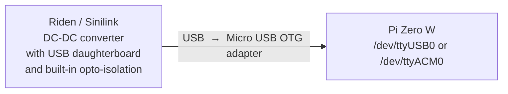
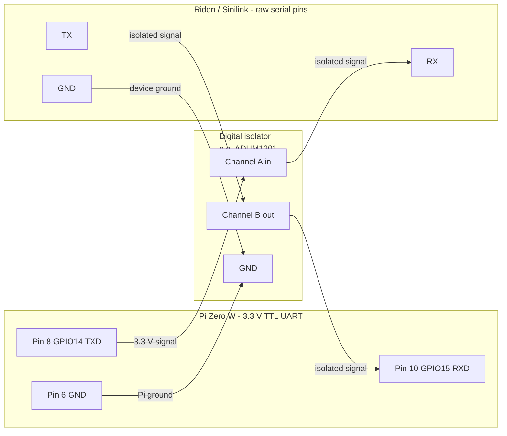

# Raspberry Pi Zero W 

## Assessment

### 1. JDK 21 availability

**Yes - JDK 21 runs on the Pi Zero W, but with important caveats.**

The Pi Zero W uses a **Broadcom BCM2835**, which is an **ARMv6** single-core CPU at 1 GHz. This is the sticking point:

- **Bellsoft Liberica JDK 21** is the only mainstream JDK that still ships an ARMv6 (32-bit soft-float / hard-float) build. Adoptium/Temurin, Amazon Corretto, and Oracle JDK all dropped ARMv6 at JDK 11 or 17.
- Liberica 21 LTS has an explicit `linux-arm32-vfp-hflt` build that targets ARMv6/v7 with hard-float ABI - exactly what the Pi Zero W needs.
- Performance will be slow: Javalin starts a Jetty server and the JVM itself is memory-heavy (~256 MB heap minimum recommended; Pi Zero W has 512 MB total RAM shared with the GPU).

**Download:** https://bell-sw.com/pages/downloads/#jdk-21-lts → Linux → ARM 32-bit

### 2. Galvanic isolation - a critical safety concern

> ⚠️ **Do not connect the Riden/Sinilink serial pins directly to the Pi GPIO, even at the correct 3.3 V voltage level.**

The Riden DPS/RD series and Sinilink XY-series devices have **no galvanic isolation** on their raw serial pins. Both the converter chassis and the Pi share a common ground through the power supply under test. Connecting them without isolation creates a **ground loop**: heavy currents can flow back through the signal wires and destroy the BCM2835 GPIO block - even if the logic voltages are matched.

The two safe approaches are described in section 4.

### 3. Attaching a Modbus RTU converter to a Pi Zero W

Modbus RTU is serial - **8N1 framing** (8 data bits, no parity, 1 stop bit), which is exactly what [`ModbusTransport`](src/main/java/com/serial/modbus/ModbusTransport.java:130) configures. There are two physical paths:

#### Option A - Device USB daughterboard via OTG (recommended)

The Riden and Sinilink devices ship with (or sell separately) a **USB daughterboard** that contains a built-in **USB-to-serial converter with opto-isolation**. Connecting via this USB board keeps the opto-isolation intact and eliminates the ground loop risk entirely.

Connect the device's USB port to the Pi Zero W's single Micro-USB OTG port using a Micro-USB OTG adapter cable. The OS enumerates the port as `/dev/ttyUSB0` or `/dev/ttyACM0`. This is identical to how it works on a PC - jSerialComm sees the same port.

#### Option B - GPIO UART with digital isolator (advanced)

The Pi Zero W exposes a **3.3 V TTL UART** on its 40-pin header:

| GPIO pin | Physical pin | Function |
|---|---|---|
| GPIO 14 (TXD) | Pin 8 | Transmit |
| GPIO 15 (RXD) | Pin 10 | Receive |
| GND | Pin 6 | Ground |

A **digital isolator IC** (e.g. ADUM1201 or equivalent) **must** be placed between the Pi UART and the device's serial pins to provide galvanic isolation. Voltage matching alone is not sufficient.

### 4. Can the Pi Zero W UART speak Modbus RTU?

**Yes - Modbus RTU is just a framing convention over plain UART.** It requires:
- 8 data bits ✓ (both TTL UART and USB-serial support this)
- No parity ✓
- 1 stop bit ✓
- Correct baud rate ✓ (115200 / 9600 / 19200 / 38400 / 57600 - all supported by the BCM2835 UART)

The application code has **no platform-specific paths** - jSerialComm handles the OS abstraction and works on Linux/ARM. The port name simply changes from `COM3` to `/dev/ttyUSB0` (USB adapter) or `/dev/ttyAMA0` (GPIO UART).

### 5. Connection diagrams

#### Option A - Device USB board via OTG (recommended)



#### Option B - GPIO UART with digital isolator



⚠️ **GPIO UART caveats:**

- The full PL011 UART (`ttyAMA0`) is claimed by **Bluetooth** by default. Disable it with `dtoverlay=disable-bt` in `/boot/firmware/config.txt`, or use the mini-UART (`ttyS0`) - which has baud-rate stability issues tied to CPU clock speed.
- Disable the **Linux serial login console** before use: run `sudo raspi-config` → Interface Options → Serial Port → disable login shell, keep hardware port enabled.
- Add your user to the **`dialout` group** to avoid permission errors:
  ```bash
  sudo usermod -a -G dialout $USER
  # then reboot or log out/in
  ```

### 6. Pi Zero W vs Pi Zero 2 W

If performance matters, the **Pi Zero 2 W** (ARMv8 quad-core, 512 MB) runs standard 64-bit JDK 21 from Adoptium/Temurin and is a drop-in size replacement. Worth considering if you want headroom for the JVM.

---
